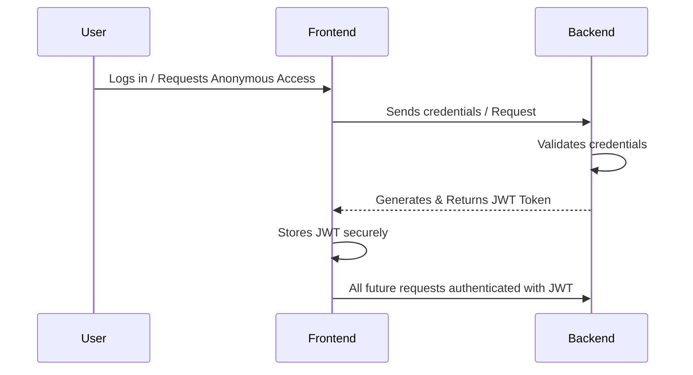
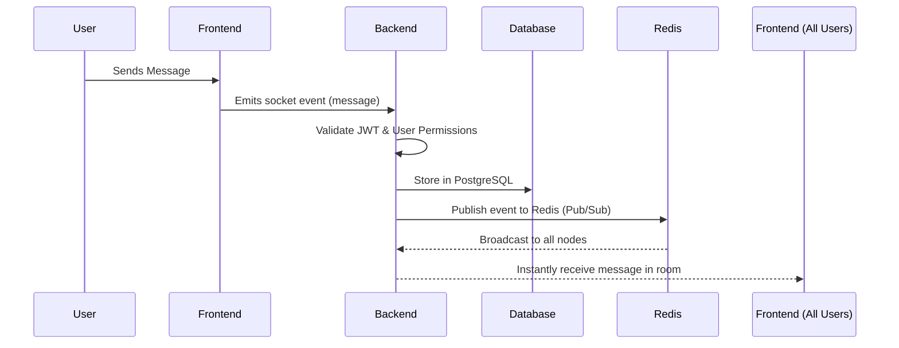
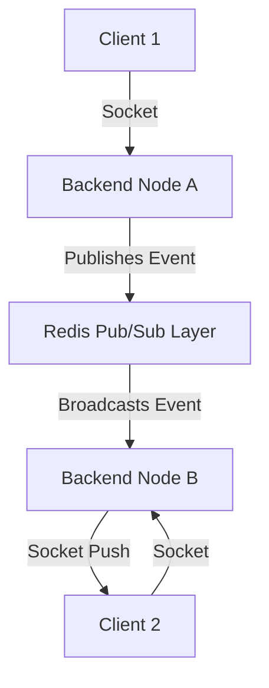
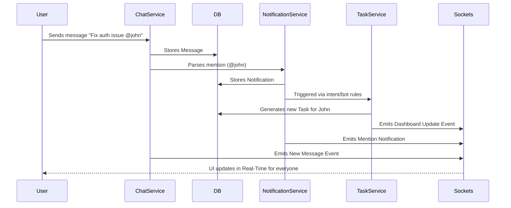

# Product Requirements Document (PRD)
**Project:** Unified Real-Time Collaboration Ecosystem
**Document Status:** V1.0 (Comprehensive)
**Target Audience:** Engineering, Product, and Architecture Teams

---

## 1. Executive Summary

### 1.1 What Is This Project?
This project is a high-performance, real-time communication and collaboration platform. It combines the structured work discussion and threading of **Slack**, the community and voice room capabilities of **Discord**, and the simple chatting experience of **WhatsApp**. 

Instead of relying on a fragmented stack (Slack for work, Discord for communities, Trello for tasks, Google Meet for calls), this platform unifies **anonymous interactions, task management, scheduling, meetings, and role-based work assignments** into **ONE unified platform**.

### 1.2 Core Architectural Philosophy
The fundamental architecture is **Event-Driven and Real-Time**. This is not a traditional HTTP request-response CRUD application.
- Users perform actions.
- Events are triggered instantly.
- The system reacts and broadcasts states in real-time.

---

## 2. Platform Systems Breakdown

The platform is strictly divided into 4 major high-level systems:

| System | Purpose |
| :--- | :--- |
| **Communication System** | Real-time chatting, direct messaging, and threading. |
| **Collaboration System** | Task creation, work assignment, and deadline scheduling. |
| **Community System** | Grouping users, channels, and role-based access control (RBAC). |
| **Real-Time Infrastructure**| Live state synchronization across distributed servers using WebSockets and Redis. |

---

## 3. Detailed Feature Specifications

### 3.1 Authentication & Identity System 👤
Handles login, signup, sessions, and JWT tokens. The platform uniquely supports a hybrid identity model.

**A. Anonymous User Mode**
- Provides a temporary identity (e.g., `ShadowTiger92`).
- Requires no permanent profile, email, or password.
- Primarily used for communities, temporary discussions, and privacy-first interaction.

**B. Persistent User Mode**
- Normal account utilizing Email/Password or OAuth.
- Maintains saved chat history, task assignments, and community roles.

**Authentication Flow:**

### 3.2 Real-Time Chat System 💬
The heart of the application. It relies entirely on **WebSockets (Socket.IO)** rather than traditional HTTP, ensuring live communication.

**Types of Chat:**
1. **Direct Message (DM):** 1 user ↔ 1 user.
2. **Group Chat:** Multiple users in a shared, ad-hoc room.
3. **Channel Chat:** Persistent rooms inside communities (e.g., `#general`, `#backend`, `#announcements`).

**Message Event Flow:**

*Why Database Storage?* To persist chat history for offline users and to provide references for threading and tasks.

### 3.3 Thread System 🧵
Conversations inside conversations, preventing main channels from becoming cluttered.

- **Architecture:** Each thread contains a `parent_message_id` and its own array of replies.
- **Why it’s important:** Organizes technical discussions and scales team communication without chaos.

*Example Structure:*
- Main Chat: "Deployment failed."
  - Thread Reply 1: "Check docker logs."
  - Thread Reply 2: "Maybe Redis crashed."

### 3.4 Community System 🏢
Communities function like Discord servers.
- **Structure:** `Community` → Contains `#channels` → Contains `Users`
- **Role-Based Access Control (RBAC):** Prevents spam and unauthorized access.
  - **Owner:** Full community access.
  - **Admin:** Can manage channels and roles.
  - **Moderator:** Can moderate chats and kick users.
  - **Member:** Basic read/write access based on channel limits.

### 3.5 Task Management System 📋
The biggest platform differentiator. Work management is integrated directly into the chat flow.

- **Concept:** A user can highlight a message (e.g., *"Fix login bug before Friday"*) and instantly convert it into a tracked Task.
- **States:** `TODO` → `IN_PROGRESS` → `BLOCKED` → `DONE`.

**Task Execution Flow:**
1. User creates task from chat UI.
2. Task is stored in PostgreSQL DB.
3. Assigned user receives an instant real-time notification.
4. Task appears in the community/user dashboard.
5. Any status updates are broadcasted in real-time to all relevant observers.

### 3.6 Notification System 🔔
Delivers live updates for mentions, task assignments, thread replies, and meeting reminders.

**Flow:**
Event occurs (e.g., mention) → Notification service triggered → Store in DB → Emit socket event to targeted user.

### 3.7 Presence System 🟢
Tracks user availability and typing status.
- **Online/Offline:** Handled natively via socket connection/disconnection events.
- **Typing Indicators:** Frontend emits `typing_start` and `typing_stop` via sockets, broadcasted to the specific room.

### 3.8 Meeting System 📞
Built-in voice calls, video calls, and screen sharing.
- **Technology:** **WebRTC** for peer-to-peer streaming.
- **Signaling Server:** The backend acts as a signaling server to help WebRTC peers discover each other and negotiate connections (SDP offers/answers).

**Meeting Flow:**
User creates meeting → Room generated → Users invited → WebRTC connection established via Signaling → Audio/Video stream begins.

### 3.9 Scheduling System 📅
Users can schedule meetings, assign deadlines, and create events.
- Stored in the database.
- Automated reminder jobs (Cron) trigger pre-event notifications.

---

## 4. Technical Architecture

### 4.1 Real-Time Infrastructure (Redis Pub/Sub) ⚡
This is the most critical technical component. If the backend is scaled to multiple servers (Node A, Node B), they must share socket events. 
- **Solution:** Redis Pub/Sub acts as the central nervous system.

### 4.2 Database Design 🗄️
Using **PostgreSQL** with **Prisma ORM**.
- **Why SQL?** The platform relies heavily on structured relationships, strict RBAC permissions, tasks tied to users, and nested threads. A relational DB is mandatory for data integrity.
- **Core Relations:** `User` has many `Messages`, `Tasks`, and belongs to many `Communities`.

### 4.3 Backend Architecture (Modular Monolith) 🧠
The backend is structured for maintainability and scalability, using a Modular Monolith approach.
- **Modules:** `Auth Module`, `Chat Module`, `Task Module`, `Meeting Module`, `Notification Module`.
- **Flow per Module:**
  `Controller / Socket Gateway` (Handles request) → `Service` (Business Logic) → `Repository / Prisma` (DB Operations) → `Database`.

### 4.4 Frontend Architecture 🚀
- **Framework:** Next.js.
- **State Management:** Zustand or Redux for managing complex distributed client state.
- **Real-Time:** Socket.IO-client.
- **UI Structure:** 
  - Left Sidebar: Communities & DMs.
  - Center Panel: Channels & Chat Interface.
  - Right Panel: Threads & Task Management.

### 4.5 Security 🔐
Due to the presence of anonymous users, security is critical.
- JWT authentication for all HTTP and Socket routes.
- Strict API Rate Limiting to prevent abuse.
- RBAC validation on every sensitive action.
- Content moderation and spam prevention mechanisms.

---

## 5. How Everything Connects (The Interconnected Architecture) 🧱

This system is an interconnected ecosystem, not just a chat app. Here is a full representation of a single action triggering a cascade of system events:

**Example Scenario: User sends the message "Fix auth issue @john"**

## 6. Final Conclusion

This platform transcends traditional chat applications by functioning as a **scalable, real-time collaboration ecosystem**. 

The engineering complexities lie in:
- Maintaining real-time synchronization.
- Scaling WebSockets horizontally.
- Enforcing distributed state and permissions.
- Guaranteeing event consistency across thousands of concurrent users.
